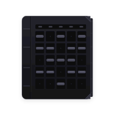

<div align="center">
  
  <h1>PK Planner</h1>
  <p><strong>Twój plan zajęć, bez szukania po tabelach.</strong><br />Wybierz grupę, ułóż własny widok i miej harmonogram zawsze pod ręką.</p>
  <p>
    <a href="https://pkplanner.sidearker.com"></a>
    <a href="https://github.com/SideArker/pk-planner/releases/latest"></a>
  </p>
</div>

---

## W skrócie

| | Funkcja |
| :---: | --- |
| 🗓️ | **Plan dopasowany do Ciebie** — wybór rocznika, przedmiotów i grup. |
| ✏️ | **Własne zajęcia i poprawki** — dodawanie bloków oraz nadpisywanie danych planu. |
| 🔎 | **Szybkie przeglądanie** — wyszukiwarka, widok dzienny i tygodniowy, filtr tygodni A/B. |
| 📥 | **Eksport do kalendarza** — plik ICS z wybranym planem. |
| 🔔 | **Powiadomienia mobilne** — zmiany planu, przypomnienia i odliczanie do zajęć. |
| 🌗 | **Jasny i ciemny motyw** — na webie i w aplikacji mobilnej. |

Aplikacja działa w przeglądarce oraz jako aplikacja mobilna Expo. Ustawienia planu są przechowywane lokalnie na urządzeniu.

[Informacja o prywatności](https://pkplanner.sidearker.com/prywatnosc.html) opisuje też dane wysyłane przy powiadomieniach na Androidzie.

## Uruchom lokalnie

Potrzebujesz **Node.js 22.12+** i **pnpm 12.9.1**.

```bash
pnpm install
pnpm dev:web       # aplikacja webowa
pnpm dev:mobile    # Expo Go / emulator / build mobilny
pnpm dev:worker    # API na Cloudflare Worker
```

Uruchom każdy serwer w osobnym terminalu. `pnpm dev:mobile` tworzy tymczasowy tunel Cloudflare i pokazuje kod QR `exps://`; adres zmienia się przy każdym uruchomieniu. Na fizycznym iPhonie Expo CLI i Expo Go muszą być zalogowane na to samo konto. Jeśli telefon widzi komputer w sieci lokalnej, możesz użyć `pnpm --filter mobile exec expo start --lan --go`.

Expo Go na Androidzie uruchamia plan i ustawienia, ale powiadomienia wymagają zainstalowanego buildu aplikacji.

### Kontrole i build

```bash
pnpm lint
pnpm typecheck
pnpm build:web
```

Build webowy trafia do `apps/web/dist`.

## Jak zbudowany jest projekt

| Katalog | Rola |
| --- | --- |
| [`apps/web`](apps/web) | React, Vite i TypeScript; strona oraz ustawienia planu. |
| [`apps/mobile`](apps/mobile) | Expo, React Native i Expo Router; plan oraz powiadomienia. |
| [`apps/worker`](apps/worker) | Cloudflare Worker; API, wersje aplikacji i rejestracja powiadomień. |
| [`packages/core`](packages/core) | Wspólne typy, parser, filtry i logika planu. |

Web i mobile importują `@pk-planner/core` bez osobnego buildu pakietu. Nowe publiczne funkcje pakietu eksportuj z [`packages/core/src/index.ts`](packages/core/src/index.ts).

## Konfiguracja API

Skopiuj [`.env.example`](.env.example) do lokalnego `.env` i ustaw adres źródłowego JSON-a planu:

```dotenv
UPSTREAM_URL=https://twoj-serwer.example/api/schedule-snapshot.php
VITE_API_URL=https://pkplanner.sidearker.com/api/schedule
EXPO_PUBLIC_API_URL=https://pkplanner.sidearker.com/api/schedule
```

`UPSTREAM_URL` jest wymagany również we wdrożonym Workerze. Gdy go brakuje, endpoint planu zwraca `500`. Zmienna `VITE_API_URL` konfiguruje web, a `EXPO_PUBLIC_API_URL` aplikację mobilną; obie wskazują nową domenę. Lokalnie web może też korzystać z `/api/schedule` przez proxy Vite.

| Endpoint | Co zwraca |
| --- | --- |
| `GET /api/schedule` | Plan pobrany z `UPSTREAM_URL`. |
| `GET /api/version` | Najnowszą wersję aplikacji, link do APK i opis zmian. |
| `GET /api/health` lub `GET /health` | Stan Workera. |
| `GET /api` | Katalog endpointów API. |
| `PUT /api/notifications/:installationId` | Rejestrację urządzenia do powiadomień. |
| `DELETE /api/notifications/:installationId` | Usunięcie rejestracji. |

Worker obsługuje też ścieżki bez `/api` na skonfigurowanej subdomenie `api.*`, np. `/schedule` i `/version`.

## Publikacja

### Web i Worker

W Cloudflare Workers Builds ustaw katalog główny repozytorium i komendę wdrożenia `pnpm build:worker`. Buduje ona web i wdraża Workera z plikami `apps/web/dist`. Główna domena to **[pkplanner.sidearker.com](https://pkplanner.sidearker.com)**, a API jest dostępne pod `/api/*`. Samą statyczną stronę można również opublikować z `apps/web/dist` przez Cloudflare Pages.

**Migracja ze starej domeny.** Adres `pk-planner.rsowa126.workers.dev` musi nadal serwować ten sam build strony. Po jego otwarciu skrypt odczytuje z lokalnego `localStorage` konfigurację planu, motyw i układ, przekazuje je do nowej domeny przez fragment URL, zapisuje przed startem Reacta i usuwa fragment z adresu. Serwerowe przekierowanie 308 ominęłoby odczyt danych na starym originie.

### Android APK

Push tagu w formacie `vMAJOR.MINOR.PATCH` uruchamia [workflow Android release](.github/workflows/android-release.yml). Workflow ustawia wersję z tagu, buduje podpisany APK i dodaje go do [GitHub Releases](https://github.com/SideArker/pk-planner/releases). Potrzebuje sekretów `GOOGLE_SERVICES_JSON_BASE64`, `ANDROID_KEYSTORE_BASE64`, `ANDROID_KEYSTORE_PASSWORD`, `ANDROID_KEY_ALIAS` i `ANDROID_KEY_PASSWORD`.

## Powiadomienia mobilne

W ustawieniach można osobno włączyć powiadomienia o zmianie planu, przypomnienia 30 minut przed zajęciami i na początku oraz odliczanie czasu zajęć. Android używa FCM HTTP v1 i Workera; Worker co minutę sprawdza zarejestrowane urządzenia oraz wersję planu. iOS używa powiadomień lokalnych. Lokalny harmonogram obejmuje najbliższe 14 dni i odnawia się po otwarciu planu.

Aby uruchomić push na Androidzie:

1. W Firebase dodaj aplikację `com.sidearker.pkplanner`, pobierz `google-services.json` i ustaw w głównym `.env` zmienną `GOOGLE_SERVICES_JSON` na **ścieżkę** do pliku. Dla buildów w GitHub Actions użyj sekretu `GOOGLE_SERVICES_JSON_BASE64`.
2. Wygeneruj JSON konta usługi z uprawnieniem do FCM HTTP v1. Pełną zawartość ustaw jako `FCM_SERVICE_ACCOUNT_JSON` w lokalnym `.env`, a we wdrożeniu jako sekret Cloudflare: `pnpm --filter worker exec wrangler secret put FCM_SERVICE_ACCOUNT_JSON`.
3. Wdróż Workera i zbuduj aplikację Android. Konfiguracja tworzy Durable Object dla rejestracji urządzeń oraz uruchamia zadanie co minutę.

Na Androidzie odliczanie aktualizuje jedno powiadomienie co 5 minut. System Android 14 i nowsze pozwalają usuwać większość powiadomień nawet przy opcji `sticky`.

---

<div align="center"><sub>PK Planner · plan zajęć pod Twoją kontrolą</sub></div>
